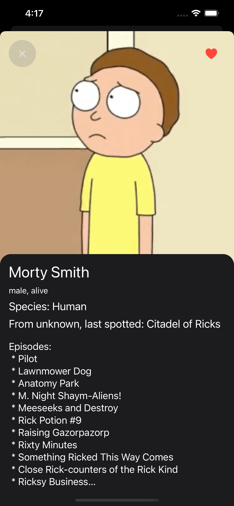

<!-- PROJECT SHIELDS -->
[![Contributors][contributors-shield]][contributors-url]
[![Stargazers][stars-shield]][stars-url]
[![Issues][issues-shield]][issues-url]
[![MIT License][license-shield]][license-url]


<!-- PROJECT LOGO AND BRIEF DESCRIPTION -->
<br />
<div align="center">
  
  
  <h3 align="center">Rick & Morty</h3>
  
  <div align="center">
    Browse characters from lovely sitcom and save your favorite ones
    <br />
    <a href="https://github.com/etimesoy/Rick-and-Morty/issues">Report Bug</a>
    ·
    <a href="https://github.com/etimesoy/Rick-and-Morty/issues">Request Feature</a>
  </div>
</div>


## Features

* Browse characters from Rick and Morty sitcom
* Filter them by name, status and/or gender
* Save favorite ones to quickly reference them later
* Look over detail information about each character


## Tools

* [RxSwift](https://github.com/ReactiveX/RxSwift) - Reactive Programming in Swift
* [XcodeGen](https://github.com/yonaskolb/XcodeGen) - A Swift command line tool for generating your Xcode project
* [Firestore](https://github.com/firebase/firebase-ios-sdk) - A cloud-hosted, NoSQL database. Used for storing favorite characters.
* MVVM as an architectural pattern
* UIKit as a framework for user interface
* async/await syntax for networking layer, diffable data source for collection view


## Screenshots

<p align="middle">
  
  
  
  
</p>


## Prerequisites

This project is using [XcodeGen](https://github.com/yonaskolb/XcodeGen), make sure you have it installed:
```sh
brew install xcodegen
```


## Getting Started

To get a local copy up and running follow these simple steps:

1. Clone the repo
   ```sh
   git clone https://github.com/etimesoy/Rick-and-Morty.git
   ```
   or
   ```sh
   git clone git@github.com:etimesoy/Rick-and-Morty.git
   ```
2. Change the current directory to Rick-and-Morty
   ```sh
   cd Rick-and-Morty
   ```
3. Run the following command to create `Rick&Morty.xcodeproj` project
   ```sh
   xcodegen
   ```
4. Open `Rick&Morty.xcodeproj` file
   ```sh
   open Rick&Morty.xcodeproj
   ```
5. When Xcode opens, launch the app using a simulator or your device by hitting Product -> Run


## License

Distributed under the MIT License. See [LICENSE](https://github.com/etimesoy/Rick-and-Morty/blob/main/LICENSE) for more information.


## Contact

Ruslan Gazizov - [@etimesoy](https://t.me/etimesoy) - ruslangazizov36@gmail.com

Project Link: [https://github.com/etimesoy/Rick-and-Morty](https://github.com/etimesoy/Rick-and-Morty)


<!-- MARKDOWN LINKS & IMAGES -->
[contributors-shield]: https://img.shields.io/github/contributors/etimesoy/Rick-and-Morty.svg?style=for-the-badge
[contributors-url]: https://github.com/etimesoy/Rick-and-Morty/graphs/contributors
[forks-shield]: https://img.shields.io/github/forks/etimesoy/Rick-and-Morty.svg?style=for-the-badge
[forks-url]: https://github.com/etimesoy/Rick-and-Morty/network/members
[stars-shield]: https://img.shields.io/github/stars/etimesoy/Rick-and-Morty.svg?style=for-the-badge
[stars-url]: https://github.com/etimesoy/Rick-and-Morty/stargazers
[issues-shield]: https://img.shields.io/github/issues/etimesoy/Rick-and-Morty.svg?style=for-the-badge
[issues-url]: https://github.com/etimesoy/v/issues
[license-shield]: https://img.shields.io/github/license/etimesoy/Rick-and-Morty.svg?style=for-the-badge
[license-url]: https://github.com/etimesoy/Rick-and-Morty/blob/main/LICENSE
